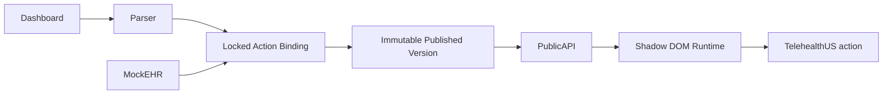

# Architecture

```mermaid
flowchart LR
  Dashboard --> Parser --> Binding[Locked Action Binding]
  MockEHR --> Binding
  Binding --> Version[Immutable Published Version]
  Version --> PublicAPI --> Runtime[Shadow DOM Runtime]
  Runtime --> EHR[TelehealthUS action]
```
The provider adapter alone establishes action identity. Presentation is validated independently and published as a versioned safe payload.
